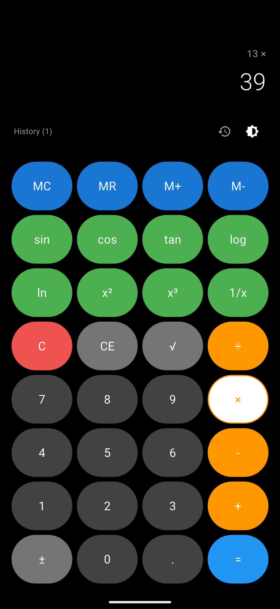
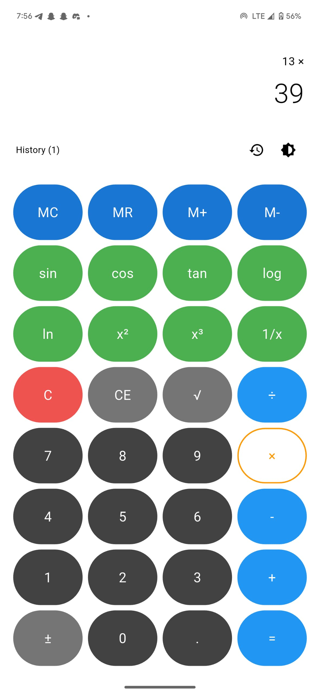

# 🔢 Flutter Interactive Calculator

A fully interactive and responsive calculator app built using **Flutter** and **Dart**, as part of a Week 2 capstone project. This project brings together all the core Flutter concepts — variables, functions, state management, user input, event handling, and UI responsiveness — in a real-world application.

🎥 **[Watch Demo on YouTube](https://youtube.com/shorts/GCGkDTTpIvw?feature=share)**

---

## 🖼️ Screenshots

| Dark Mode                                                   | Light Mode                                                    |
|-------------------------------------------------------------|---------------------------------------------------------------|
|  |  |

---

## 📚 Project Overview

The **Flutter Calculator App** is designed to mimic real calculator functionality while offering enhanced features for usability and learning.

### ✅ Core Features

- **Basic Arithmetic Operations**
  - Addition `+`, Subtraction `−`, Multiplication `×`, Division `÷`
- **Advanced Functions**
  - Division `/`, Modulo `%`, Toggle Sign `±`, Square root `√`, Reciprocal `1/x`
- **Scientific Functions**
  - Trigonometric: `sin`, `cos`, `tan`
  - Logarithmic: `log`, `ln`
  - Powers: `x²`, `x³`
- **Memory Functions**
  - `MC` – Memory Clear  
  - `MR` – Memory Recall  
  - `M+` – Memory Add  
  - `M−` – Memory Subtract
- **History Tracking**
  - Keeps a log of recent calculations
- **Keyboard Input Support**
  - Use physical keyboard input for faster entry
- **Responsive Design**
  - Fully adaptable UI for different screen sizes and themes (dark/light)
- **Error Handling**
  - Graceful handling of division by zero and malformed expressions

---

## 🧰 Getting Started

### 🔨 Prerequisites

- Flutter SDK installed ([Flutter Installation Guide](https://flutter.dev/docs/get-started/install))
- A working Android emulator or physical device

### ▶️ Run the App

1. **Clone the repo**
   ```bash
   git clone https://github.com/Akindolie/calulator.git
   cd calulator
